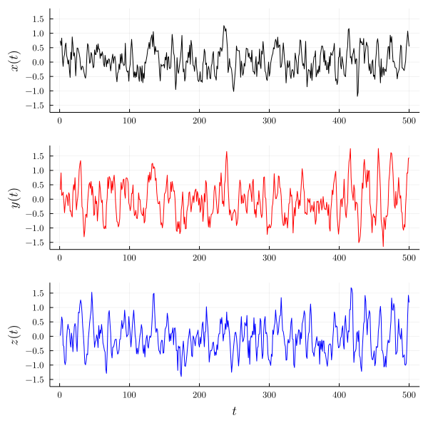
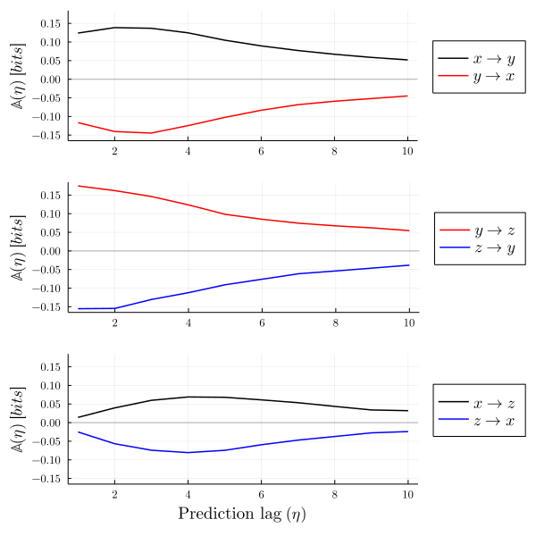
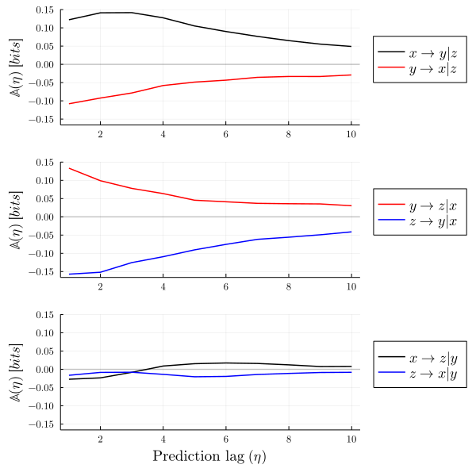
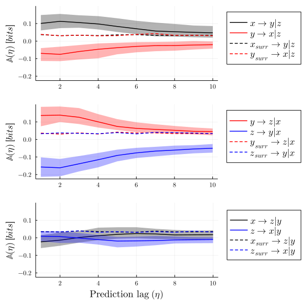

## A brief tutorial

Here's an example of how to use the predictive asymmetry function in the [CausalityTools.jl](https://github.com/JuliaDynamics/CausalityTools.jl) package to characterize causal relationships directly from time series. The example was made in a [JupyterLab](https://jupyter.org) notebook using a [Julia](https://julialang.org) 1.6.0 kernel and [CausalityTools.jl](https://github.com/JuliaDynamics/CausalityTools.jl) version 1.2.0.

For more details on the method see the preprint by [Haaga *et al.*](https://www.earthsystemevolution.com/publication/haaga_et_al_2020/) and the package [documentation](https://juliadynamics.github.io/CausalityTools.jl/stable/).

***

We first create a dedicated folder and start by activating a Julia project in that folder:

```julia
using Pkg
Pkg.activate("./")
```

Then we add the required packages to the project:

```julia
Pkg.add(["CausalityTools", "Plots", "Distributions", "LaTeXStrings"])
```

Now we are ready to load the modules we need for this example:

```julia
using CausalityTools, Random, Distributions, Plots, LaTeXStrings
```

## Some example data

Let's create some example data with three dynamical variables coupled $x \to y \to z$. In other words, $x$ drives $y$ and $y$ drives $z$. The system is stochastic with dynamical noise.

```julia
npts = 500 # Number of points in the time series

Random.seed!(76534) # Set the seed to reproduce exactly

N = Normal(0, 1) # A standard normal distribution for noise

# System coefficients
a₁, a₂ = 0.7, 0.1
b₁, b₂ = 0.75, 0.2
c₁, c₂ = 0.6, 0.2

# Coupling strengths, where
# C₁₂ modulates x -> y
# C₂₃ modulates y -> z 
C₁₂, C₂₃ = 0.4, 0.4

# Noise levels
ϵ₁, ϵ₂, ϵ₃ = 0.3, 0.3, 0.3

s = rand(npts, 3) # Initialize 3-D system

for t in 5:npts
    s[t,1] = a₁*s[t-1,1] - a₂*s[t-4,1] +                ϵ₁*rand(N)
    s[t,2] = b₁*s[t-1,2] - b₂*s[t-4,2] + C₁₂*s[t-1,1] + ϵ₂*rand(N)
    s[t,3] = c₁*s[t-1,3] - c₂*s[t-3,3] + C₂₃*s[t-1,2] + ϵ₃*rand(N)
end

# Assign x, y, z time series
x, y, z = [s[:, i] for i = 1:3]

# Plot time series
px = plot(1:npts, x, c = :black)
py = plot(1:npts, y, c = :red)
pz = plot(1:npts, z, c = :blue)

# set some nice plot font defaults
default(fontfamily="Computer Modern",
        yguidefontsize = 12,
        ytickfontsize = 8,
        xguidefontsize = 12,
        xtickfontsize = 8,
        legendfontsize = 12)

plot(px, py, pz, layout = grid(3,1), link = :all, legend = false,
    xlabel =["" "" L"t"],  ylabel = [L"x(t)" L"y(t)" L"z(t)"], size = (600, 600))

```



## Computing the Predictive asymmetry

Now, we'll try to see if we can recover the unidirectional relationships $x \to y \to z$ by computing the predictive asymmetry from the time series data. The predictive asymmetry is an information-theoretic method that uses entropy estimators from [Entropies.jl](https://github.com/JuliaDynamics/Entropies.jl). The particular implementation of predictive asymmetry used here is based on computing [Transfer Entropy](https://juliadynamics.github.io/CausalityTools.jl/stable/TransferEntropy/) across a range of temporal prediction lags. We here use a simple estimator that counts visitation frequency of states in a rectangular binning of the state space. For more background on transfer entropy and details on embedding parameters and different estimators, please see the [documentation](https://juliadynamics.github.io/CausalityTools.jl/stable/).

```julia
ηs = 1:10 # Prediction lags

# Specify an underlying estimator for transfer entropy
est = VisitationFrequency(RectangularBinning(4)) 

pa_xy = predictive_asymmetry(x, y, est, ηs) # from x to y
pa_yx = predictive_asymmetry(y, x, est, ηs) # from y to x
pa_yz = predictive_asymmetry(y, z, est, ηs) # etc...
pa_zy = predictive_asymmetry(z, y, est, ηs)
pa_xz = predictive_asymmetry(x, z, est, ηs)
pa_zx = predictive_asymmetry(z, x, est, ηs)
;
```

```julia
p_xy =  plot(ηs, pa_xy, label = L"x \to y", c = :black)
        plot!(ηs, pa_yx, label = L"y \to x", c = :red)
        hline!([0], lw = 1, α = 0.2, c = :black, label = "")

p_yz =  plot(ηs, pa_yz, label = L"y \to z", c = :red)
        plot!(ηs, pa_zy, label = L"z \to y", c = :blue)
        hline!([0], lw = 1, α = 0.2, c = :black, label = "")

p_xz =  plot(ηs, pa_xz, label = L"x \to z", c = :black)
        plot!(ηs, pa_zx, label = L"z \to x", c = :blue)
        hline!([0], lw = 1, α = 0.2, c = :black, label = "")

plot(p_xy, p_yz, p_xz, lw = 1.5, layout = grid(3, 1), 
    size = (600, 600), link= :all, legend = :outerright, 
    xlabel =["" "" "Prediction lag "*L"(\eta)"],  ylabel = L"\mathbb{A}(\eta)\ [bits]")
```



The predictive asymmetry results can be interpreted as follows: If two variables $a$ and $b$ are dynamically coupled in a *unidirectional* causal relationship $a \to b$, then we expect the predictive asymmetry from the driver variable $a$ to the response variable $b$ to be positive: ${\mathbb{A}}\_{a \to b} > 0$. Conversely, we expect the predictive asymmetry from the response variable $b$ to the driver variable $a$ to be zero or negative:  $\mathbb{A}\_{b \to a} \leq 0$. If there is a *bidirectional* coupling, then we expect both $\mathbb{A}\_{a \to b}$ and $\mathbb{A}\_{b \to a}$ to be positive. Furthermore, we expect the predictive asymmetry to converge towards zero with increasing prediction lag in a system-dependent manner, as the influence of the driver on the response variable diminishes.

In our example system, we have two direct causal relationships, $x \to y$ and $y \to z$, and one indirect causal relationship $x \to z$. All these relationships are unidirectional. Our results show that the predictive asymmetry for the direct relationships $\mathbb{A}\_{x \to y}$ and $\mathbb{A}\_{y \to z}$ are both positive. The indirect relationship $\mathbb{A}\_{x \to z}$ is also positive but arguably a bit weaker. In the non-causal direction, $\mathbb{A}\_{y \to x}$, $\mathbb{A}\_{z \to y}$ and $\mathbb{A}\_{z \to x}$ are all negative. In this example the predictive asymmetry is thus able to detect the underlying causal relationships and characterize them as unidirectional.

However, these pairwise results do not tell us whether $x \to z$ is a direct relationship or is accounted for by the intermediate variable $y$. To further distinguish between direct and indirect causal relationships, we can compute the *conditional* predictive asymmetry:

## Conditional Predictive Asymmetry

If $x \to y$ and $y \to z$, then the causal relationship $x \to z$ is mediated by the variable $y$, and the variable $x$ should not contain any independent information on $z$ that is not already contained in $y$. In other words, we expect the conditional predictive asymmetry $\mathbb{A}\_{x \to z | y}$ to vanish. To explore this, we can simply add the third variable as a conditional in the ``predictive_asymmetry`` function:

```julia
pa_xyz = predictive_asymmetry(x, y, z, est, ηs)
pa_yxz = predictive_asymmetry(y, x, z, est, ηs)
pa_yzx = predictive_asymmetry(y, z, x, est, ηs)
pa_zyx = predictive_asymmetry(z, y, x, est, ηs)
pa_xzy = predictive_asymmetry(x, z, y, est, ηs)
pa_zxy = predictive_asymmetry(z, x, y, est, ηs)
;
```

```julia
p_xyz = plot(ηs, pa_xyz, label = L"x \to y | z", c = :black)
        plot!(ηs, pa_yxz, label = L"y \to x  | z", c = :red)
        hline!([0], α = 0.2, c = :black, label = "")

p_yzx = plot(ηs, pa_yzx, label = L"y \to z | x", c = :red)
        plot!(ηs, pa_zyx, label = L"z \to y | x", c = :blue)
        hline!([0], α = 0.2, c = :black, label = "")

p_xzy = plot(ηs, pa_xzy, label = L"x \to z | y", c = :black)
        plot!(ηs, pa_zxy, label = L"z \to x | y", c = :blue)
        hline!([0], α = 0.2, c = :black, label = "")

plot(p_xyz, p_yzx, p_xzy, lw = 1.5, layout = grid(3, 1), 
    size = (600, 600), link= :all, legend = :outerright,
    xlabel =["" "" "Prediction lag "*L"(\eta)"],  ylabel = L"\mathbb{A}(\eta)\ [bits]")
```



Predictive asymmetry for the direct causal relationships $x \to y$ and $y \to z$ seem to be qualitatively unaffected by conditioning on a third variable. For the indirect relationship $x \to z$, however, the result becomes a bit more ambiguous when conditioning on the intermediate variable $y$.

The difficulty in interpreting the results for $\mathbb{A}\_{x \to z | y}$ brings up an important issue: the predictive asymmetry is ultimately a *statistical* approach to causality detection, and we are dealing with finite time series (500 observations) of a stochastic system. How robust are these results to statistical fluctuations and how do we assess the sensitivity and specificity of the predictive asymmetry?

A common approach to limit false positives in causal inference from time series is the method of surrogates. Surrogates are copies of the original time series where some specific properties of the data have been randomized to break the causal coupling. We provide a wide range of different surrogate techniques in the [TimeSeriesSurrogates.jl](https://juliadynamics.github.io/TimeseriesSurrogates.jl/stable/) package.

In the case of real-world data, the effect of statistical fluctuations can be assessed by iterative resampling within the uncertainty envelopes (e.g. error bars) of the observations. Here we can iterate over multiple realizations of the stochastic system.

## Statistical testing with surrogates

```julia

# bundle the example system in a function

function example_system(npts)
    N = Normal(0, 1)
    a₁, a₂ = 0.7, 0.1 
    b₁, b₂ = 0.75, 0.2
    c₁, c₂ = 0.6, 0.2
    C₁₂, C₂₃ = 0.4, 0.4
    ϵ₁, ϵ₂, ϵ₃ = 0.3, 0.3, 0.3
    s = rand(npts, 3)
    for t in 5:npts
        s[t,1] = a₁*s[t-1,1] - a₂*s[t-4,1] +                ϵ₁*rand(N)
        s[t,2] = b₁*s[t-1,2] - b₂*s[t-4,2] + C₁₂*s[t-1,1] + ϵ₂*rand(N)
        s[t,3] = c₁*s[t-1,3] - c₂*s[t-3,3] + C₂₃*s[t-1,2] + ϵ₃*rand(N)
    end
    x, y, z = [s[:, i] for i = 1:3]
    return x, y, z
end

```

```julia

npts = 500
n_reps = 50 # number of realizations of the system
n_surr = 20 # number of surrogates per realization
surr_type = RandomShuffle() # the simplest type of surrogate

pas_xyz = zeros(n_reps, length(ηs))
pas_yxz = zeros(n_reps, length(ηs))
pas_yzx = zeros(n_reps, length(ηs))
pas_zyx = zeros(n_reps, length(ηs))
pas_xzy = zeros(n_reps, length(ηs))
pas_zxy = zeros(n_reps, length(ηs))

pas_xyz_surr = zeros(n_reps, n_surr, length(ηs))
pas_yxz_surr = zeros(n_reps, n_surr, length(ηs))
pas_yzx_surr = zeros(n_reps, n_surr, length(ηs))
pas_zyx_surr = zeros(n_reps, n_surr, length(ηs))
pas_xzy_surr = zeros(n_reps, n_surr, length(ηs))
pas_zxy_surr = zeros(n_reps, n_surr, length(ηs))

for i in 1:n_reps
    
    x, y, z = example_system(npts)
    
    pas_xyz[i, :] = predictive_asymmetry(x, y, z, est, ηs)
    pas_yxz[i, :] = predictive_asymmetry(y, x, z, est, ηs)
    pas_yzx[i, :] = predictive_asymmetry(y, z, x, est, ηs)
    pas_zyx[i, :] = predictive_asymmetry(z, y, x, est, ηs)
    pas_xzy[i, :] = predictive_asymmetry(x, z, y, est, ηs)
    pas_zxy[i, :] = predictive_asymmetry(z, x, y, est, ηs)
    
    sx = surrogenerator(x, surr_type)
    sy = surrogenerator(y, surr_type)
    sz = surrogenerator(z, surr_type)

    for k in 1:n_surr
        pas_xyz_surr[i, k, :] = predictive_asymmetry(sx(), sy(), sz(), est, ηs)
        pas_yxz_surr[i, k, :] = predictive_asymmetry(sy(), sx(), sz(), est, ηs)
        pas_yzx_surr[i, k, :] = predictive_asymmetry(sy(), sz(), sx(), est, ηs)
        pas_zyx_surr[i, k, :] = predictive_asymmetry(sz(), sy(), sx(), est, ηs)
        pas_xzy_surr[i, k, :] = predictive_asymmetry(sx(), sz(), sy(), est, ηs)
        pas_zxy_surr[i, k, :] = predictive_asymmetry(sz(), sx(), sy(), est, ηs)
    end
end

```

```julia
# prepare quantiles for plotting

# get three quantiles for ribbon plot across realizations
Axyz = [quantile(pas_xyz[:, i], [0.025, 0.50, 0.975] ) for i in ηs]
Ayxz = [quantile(pas_yxz[:, i], [0.025, 0.50, 0.975] ) for i in ηs]
Ayzx = [quantile(pas_yzx[:, i], [0.025, 0.50, 0.975] ) for i in ηs]
Azyx = [quantile(pas_zyx[:, i], [0.025, 0.50, 0.975] ) for i in ηs]
Axzy = [quantile(pas_xzy[:, i], [0.025, 0.50, 0.975] ) for i in ηs]
Azxy = [quantile(pas_zxy[:, i], [0.025, 0.50, 0.975] ) for i in ηs]

# get upper quantile of surrogates
Sxyz = [quantile(reshape(pas_xyz_surr, (length(ηs), n_surr*n_reps))[i,:], 0.99) for i in ηs]
Syxz = [quantile(reshape(pas_yxz_surr, (length(ηs), n_surr*n_reps))[i,:], 0.99) for i in ηs]
Syzx = [quantile(reshape(pas_yzx_surr, (length(ηs), n_surr*n_reps))[i,:], 0.99) for i in ηs]
Szyx = [quantile(reshape(pas_zyx_surr, (length(ηs), n_surr*n_reps))[i,:], 0.99) for i in ηs]
Sxzy = [quantile(reshape(pas_xzy_surr, (length(ηs), n_surr*n_reps))[i,:], 0.99) for i in ηs]
Szxy = [quantile(reshape(pas_zxy_surr, (length(ηs), n_surr*n_reps))[i,:], 0.99) for i in ηs]
;
```

```julia
ps_xyz = plot(ηs, getindex.(Axyz, 2), label = L"x \to y | z", c = :black,
        ribbon = (getindex.(Axyz, 2) - getindex.(Axyz, 1), getindex.(Axyz, 3) - getindex.(Axyz, 2)))
        plot!(ηs, getindex.(Ayxz, 2), label = L"y \to x  | z", c = :red,
        ribbon = (getindex.(Ayxz, 2) - getindex.(Ayxz, 1), getindex.(Ayxz, 3) - getindex.(Ayxz, 2)))
        plot!(ηs, Sxyz, ls = :dash, c = :black, label = L"x_{surr} \to y | z")
        plot!(ηs, Syxz, ls = :dash, c = :red, label = L"y_{surr} \to x | z")

ps_yzx = plot(ηs, getindex.(Ayzx, 2), label = L"y \to z | x", c = :red,
        ribbon = (getindex.(Ayzx, 2) - getindex.(Ayzx, 1), getindex.(Ayzx, 3) - getindex.(Ayzx, 2)))
        plot!(ηs, getindex.(Azyx, 2), label = L"z \to y  | x", c = :blue,
        ribbon = (getindex.(Azyx, 2) - getindex.(Azyx, 1), getindex.(Azyx, 3) - getindex.(Azyx, 2)))
        plot!(ηs, Syzx, ls = :dash, c = :red, label = L"y_{surr} \to z | x")
        plot!(ηs, Szyx, ls = :dash, c = :blue, label = L"z_{surr} \to y | x")

ps_xzy = plot(ηs, getindex.(Axzy, 2), label = L"x \to z | y", c = :black,
        ribbon = (getindex.(Axzy, 2) - getindex.(Axzy, 1), getindex.(Axzy, 3) - getindex.(Axzy, 2)))
        plot!(ηs, getindex.(Azxy, 2), label = L"z \to x  | y", c = :blue,
        ribbon = (getindex.(Azxy, 2) - getindex.(Azxy, 1), getindex.(Azxy, 3) - getindex.(Azxy, 2)))
        plot!(ηs, Sxzy, ls = :dash, c = :black, label = L"x_{surr} \to z | y")
        plot!(ηs, Szxy, ls = :dash, c = :blue, label = L"z_{surr} \to x | y")

plot(ps_xyz, ps_yzx, ps_xzy, lw = 1.5, layout = grid(3, 1), fillalpha = 0.3,
    size = (600, 600), link= :all, legend = :outerright, legendfontsize = 12,
    xlabel =["" "" "Prediction lag "*L"(\eta)"],  ylabel = L"\mathbb{A}(\eta)\ [bits]")
```



When iterating over multiple realizations of the system, we find that conditional predictive asymmetry values for the relationships $x \to y | z$ and $y \to z | x$ are well above the surrogates, whereas for $x \to z | y$ it is not, suggesting that the latter is an indirect relationship mediated by $y$.

Other examples can be found in the short tutorials on [CausalityTools](../causalitytools/) and [UncertainData](../uncertaindata/).
***
