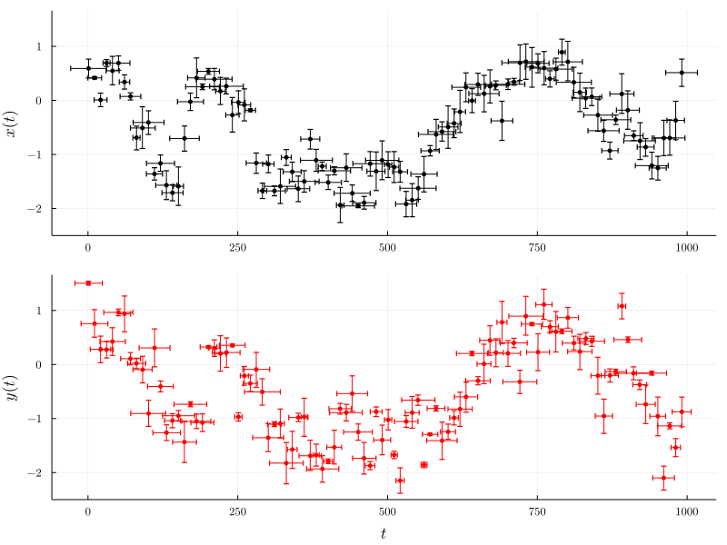
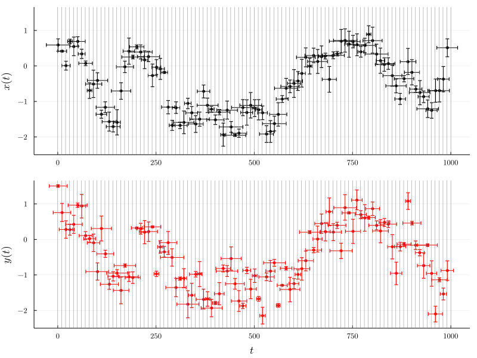
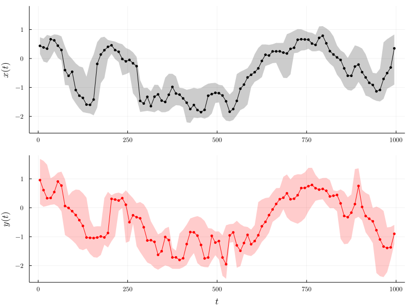
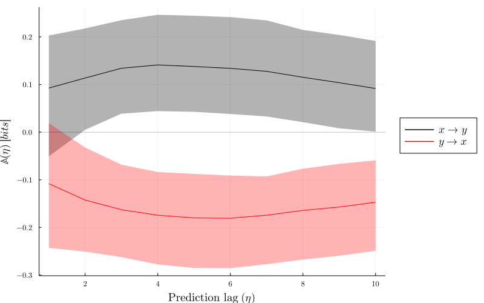

### A brief tutorial

[UncertainData.jl](https://github.com/kahaaga/UncertainData.jl) is a Julia package developed by [Kristian A. Haaga](../../authors/kristian/) for handling data with associated uncertainties and datasets consisting of uncertain values. These uncertain data values are stored in the form of probability distributions or populations. Computational data analyses are performed by resampling the distributions furnishing the uncertain values. For more details, please see the [documentation](https://kahaaga.github.io/UncertainData.jl/stable/).

This example was made in a [JupyterLab](https://jupyter.org) notebook using a [Julia](https://julialang.org) 1.6.0 kernel, [UncertainData.jl](https://github.com/kahaaga/UncertainData.jl) version 0.16.0 and [CausalityTools.jl](https://github.com/JuliaDynamics/CausalityTools.jl) version 1.2.0.

***

We first create a dedicated folder and start by activating a Julia project in that folder:

```julia
using Pkg
Pkg.activate("./")
```

Then we add the required packages to the project:

```julia
Pkg.add(["UncertainData", "CausalityTools", "Distributions", "Plots", "LaTeXStrings"])
```

Now we are ready to load the modules we need for this example:

```julia
using UncertainData, CausalityTools, Distributions, Plots, LaTeXStrings
```

### Time series with uncertainty

The UncertainData.jl package is primarily intended for use with real-world data, but here we generate synthetic data using one of the example systems available as built-in functions in [CausalityTools.jl](https://github.com/JuliaDynamics/CausalityTools.jl) Let's choose a stochastic dynamical system consisting of two first-order autoregressive (AR1) processes unidirectionally coupled $x \to y$. We use the function ``ar1_unidir``, which takes the following arguments:

- $u_0$, a two-element vector specifying the initial states of $x$ and $y$
- $a_{1}$ and $b_{1}$ are the model parameters
- $c_{xy}$, a scalar controlling the strength of the influence of $x$ on $y$
- $\sigma$ is the standard deviation of the noise terms

For more details on this system, see [Example systems](https://juliadynamics.github.io/CausalityTools.jl/stable/example_systems/) in the documentation.

```julia
system = ar1_unidir(u₀ = rand(2), 
                    a₁ = 0.90693, 
                    b₁ = 0.40693, 
                    c_xy = 0.5, 
                    σ = 0.40662)
```

Now we can generate time series from this system and then add uncertainty both to the values and to the time indices. The latter is relevant for data such as paleoclimate proxies with geochronological (e.g. radiocarbon dating) uncertainty.

For this we can use the convenience function ``example_uncertain_indexvalue_dataset`` from the [UncertainData.jl](https://github.com/kahaaga/UncertainData.jl) package. This function generates a pair of ``UncertainIndexValueDatasets`` from a discrete dynamical ``system`` by iterating the system ``npts`` times after a transient run of ``tstep`` steps, then it gathers two variables defined by column indices ``vars`` as time series ``x`` and ``y``.

These time series are then converted to uncertain data by replacing each value with a probability distribution, in this case a normal distribution defined by a mean (the original value) and a standard deviation (user defined). Hence, ``x[i]`` and ``y[i]`` are replaced with ``UncertainValue(Normal, x[i], d_xval)`` and ``UncertainValue(Normal, y[i], d_yval)``, respectively. The time indices for ``x`` and ``y`` are also replaced with normal distributions, such that ``x_inds[i] = UncertainValue(Normal, i, d_xind)``, and ``y_inds[i] = UncertainValue(Normal, i, d_yind)``.

The function returns a tuple of ``UncertainIndexValueDataset`` instances, one for ``x`` and one for ``y``.

```julia
vars = (1, 2)
npts, tstep = 100, 10

# Let's draw random values for the std. devs.
d_xind, d_yind = Uniform(2.5, 15.5), Uniform(2.5, 15.5)
d_xval, d_yval = Uniform(0.01, 0.2), Uniform(0.01, 0.2)

x, y = example_uncertain_indexvalue_datasets(system,
        npts, vars, tstep = tstep,
        d_xind = d_xind, d_yind = d_yind,
        d_xval = d_xval, d_yval = d_yval)

# set some nice plot font defaults
default(fontfamily="Computer Modern",
        yguidefontsize = 12,
        ytickfontsize = 8,
        xguidefontsize = 12,
        xtickfontsize = 8,
        legendfontsize = 12)

qs = [0.025, 0.975] # quantile range for error bars

px = plot(x, qs, qs, ms = 3, c = :black, marker = stroke(0.01, :black))
py = plot(y, qs, qs, ms = 3, c = :red, marker = stroke(0.01, :red))

plot(px, py, layout = grid(2,1), link = :all, legend = false,
    xlabel =["" L"t"],  ylabel = [L"x(t)" L"y(t)"], size = (800, 600))
```



These time series have variable uncertainties on their time indices, hence they are not on a regularly spaced grid. This irregularity can create problems for many time series analysis methods, including lag-based causality estimators. One solution is to resample the data on a regular time grid. Let's choose a grid where the left bin edges range from 0 to 1000 in steps of 10, which would look like this:

```julia
tgrid = 0:10:1000

plot(px, py, layout = grid(2,1), link = :all, legend = false,
    xlabel =["" L"t"],  ylabel = [L"x(t)" L"y(t)"], size = (800, 600))
vline!([tgrid tgrid] |> collect, c = :grey, lw = .5)
```



Now we can use ``BinnedResampling`` to resample within the uncertainties in each bin, keeping track of all draws falling in a particular bin. Uncertainty distributions in a bin are then estimated by a kernel density estimate over the draws falling in that bin.

Here we'll sample each point in the dataset 1000 times, yielding a total of 100 $\times$ 1000 draws from which the distributions are estimated.

```julia
resampling = BinnedResampling(tgrid, 1000)
x_binned = resample(x, resampling)
y_binned = resample(y, resampling)


# get three quantiles for ribbon plot
qs_x = quantile.(x_binned.values, [0.025 0.50 0.975])
qs_y = quantile.(y_binned.values, [0.025 0.50 0.975])
rib_x = (qs_x[:, 2] - qs_x[:, 1] , qs_x[:, 3]  - qs_x[:, 2])
rib_y = (qs_y[:, 2] - qs_y[:, 1] , qs_y[:, 3]  - qs_y[:, 2])

# get time bin midpoints
t_bin = [x_binned.indices[i].value for i in 1:length(tgrid)-1]

pxr = scatter(t_bin, qs_x[:, 2], ms = 3, c = :black)
     plot!(t_bin, qs_x[:, 2], lw = 1, c = :black,
           ribbon = rib_x, fillalpha = 0.2)
pyr = scatter(t_bin, qs_y[:, 2], ms = 3, c = :red, msc = :red)
     plot!(t_bin, qs_y[:, 2], lw = 1, c = :red,
           ribbon = rib_y, fillalpha = 0.2)

plot(pxr, pyr, layout = grid(2,1), link = :all, legend = false,
    xlabel =["" L"t"],  ylabel = [L"x(t)" L"y(t)"], size = (800, 600))
```



Now we have represented $x$ and $y$ on a regular time grid as distributions that take into account uncertainties in both the original values and the original time indices. We can then generate time series from within those distributions using the ``resample`` function and perform any time series analysis we want. As an example, we will (again, shamelessly) use the [Predictive Asymmetry](https://juliadynamics.github.io/CausalityTools.jl/dev/predictive_asymmetry/) method proposed by [Haaga *et al*](https://www.earthsystemevolution.com/publication/haaga_et_al_2020/). The particular implementation of predictive asymmetry used here is based on computing [Transfer Entropy](https://juliadynamics.github.io/CausalityTools.jl/stable/TransferEntropy/) across a range of temporal prediction lags. We choose a simple estimator that counts visitation frequency of states in a rectangular binning of the state space. For more background on these methods, including details on embedding parameters and different estimators, please see the [documentation](https://juliadynamics.github.io/CausalityTools.jl/stable/).

### Causal analysis

```julia
ηs = 1:10 # Prediction lags

# Specify an underlying estimator for transfer entropy
est = VisitationFrequency(RectangularBinning(4)) 

n_reps = 500 # number of resamplings of the binned data

pas_xy = zeros(n_reps, length(ηs))
pas_yx = zeros(n_reps, length(ηs))

for i in 1:n_reps
    
    xr = getindex(resample(x_binned), 2)
    yr = getindex(resample(y_binned), 2)
    
    pas_xy[i, :] = predictive_asymmetry(xr, yr, est, ηs)
    pas_yx[i, :] = predictive_asymmetry(yr, xr, est, ηs)
end
```

```julia
# get three quantiles for ribbon plot
A_xy = [quantile(pas_xy[:,i], [0.025 0.50 0.975]) for i in ηs]
A_yx = [quantile(pas_yx[:,i], [0.025 0.50 0.975]) for i in ηs]
rib_xy = (getindex.(A_xy, 2) - getindex.(A_xy, 1), 
          getindex.(A_xy, 3)  - getindex.(A_xy, 2))
rib_yx = (getindex.(A_yx, 2) - getindex.(A_yx, 1), 
          getindex.(A_yx, 3)  - getindex.(A_yx, 2))

plot(lw = 1.5, size = (800, 500), legend = :outerright, 
    xlabel = "Prediction lag "*L"(\eta)",  ylabel = L"\mathbb{A}(\eta)\ [bits]")
plot!(ηs, getindex.(A_xy, 2), label = L"x \to y", c = :black,
        ribbon = rib_xy, fillalpha = 0.3)
plot!(ηs, getindex.(A_yx, 2), label = L"y \to x", c = :red,
        ribbon = rib_yx, fillalpha = 0.3)
        hline!([0], lw = 1, α = 0.2, c = :black, label = "")
```



The predictive asymmetry results can be interpreted as follows: If two variables $a$ and $b$ are dynamically coupled in a *unidirectional* causal relationship $a \to b$, then we expect the predictive asymmetry from the driver variable $a$ to the response variable $b$ to be positive: $\mathbb{A}\_{a \to b} > 0$. Conversely, we expect the predictive asymmetry from the response variable $b$ to the driver variable $a$ to be zero or negative:  $\mathbb{A}\_{b \to a} \leq 0$. If there is a *bidirectional* coupling, then we expect both $\mathbb{A}\_{a \to b}$ and $\mathbb{A}\_{b \to a}$ to be positive. Furthermore, we expect the predictive asymmetry to converge towards zero with increasing prediction lag in a system-dependent manner, as the influence of the driver on the response variable diminishes.

In this case we find that the predictive asymmetry in the causal direction ($\mathbb{A}\_{x \to y}$) is positive, whereas the asymmetry in the non-causal direction ($\mathbb{A}\_{y \to x}$) is negative. We thus recover the expected unidirectional causal relationship $x \to y$. We stress, however, that the results will vary considerably with different realizations of the stochastic system and with different parameters, especially for short time series (here $n = 100$). See [Haaga *et al.*](https://www.earthsystemevolution.com/publication/haaga_et_al_2020/) for a more comprehensive analysis of sensitivity and specificity for autoregressive processes and many other systems.

Other examples can be found  in the short tutorials on [CausalityTools](../causalitytools/) and [Predictive Asymmetry](../asymmetrytest/).

***

If you use [UncertainData.jl](https://github.com/kahaaga/UncertainData.jl) for any of your projects or scientific publications, please cite this small [Journal of Open Source Software (JOSS) publication](https://joss.theoj.org/papers/10.21105/joss.01666).
