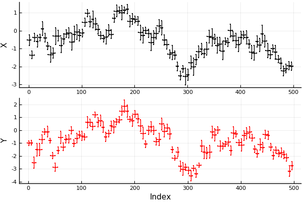
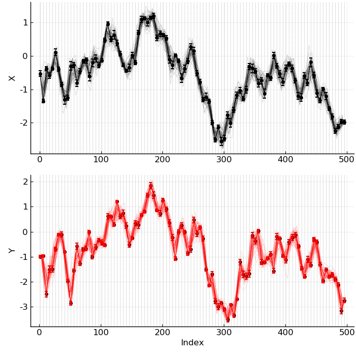
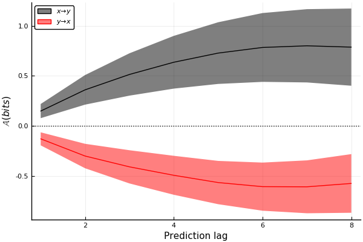

+++
title = "Uncertain Data"
subtitle = ""
date = 2019-11-11T00:00:00
lastmod = 2019-11-11T00:00:00
draft = false

# Authors. Comma separated list, e.g. `["Bob Smith", "David Jones"]`.
authors = ["Kristian A. Haaga"]

tags = []
summary = "A Julia package for working with uncertain values and datasets."

# Projects (optional).
#   Associate this post with one or more of your projects.
#   Simply enter your project's folder or file name without extension.
#   E.g. `projects = ["deep-learning"]` references
#   `content/project/deep-learning/index.md`.
#   Otherwise, set `projects = []`.
projects = ["uncertaindata"]
+++

[UncertainData.jl](https://github.com/kahaaga/UncertainData.jl) provides tools to systematically deal with uncertain data, and to sample from uncertain datasets more rigorously. It makes workflows involving uncertain data of different types and from different sources significantly easier. It was originally designed to form the backbone of the uncertainty handling in [CausalityTools.jl](https://github.com/JuliaDynamics/CausalityTools.jl).

For more information, see the [documentation](https://kahaaga.github.io/UncertainData.jl/dev/).

If you use ``UncertainData.jl`` for any of your projects or scientific publications, please cite this [Journal of Open Source Software (JOSS) publication](https://joss.theoj.org/papers/10.21105/joss.01666).


# An example

Here's an example illustrating how the functionality of the ``UncertainData.jl`` package is integrated with the ``CausalityTools.jl`` package.  The ``jupyter`` notebook was run with a Julia 1.2 kernel. (*Note*: Pending a 1.0 release of ``CausalityTools.jl``, there may be breaking changes).


```julia
using UncertainData, CausalityTools, Distributions, StatsBase,
    Test, Interpolations, Measures, LaTeXStrings
using Plots; pyplot();
```

## Time series with uncertainty
Let's consider a case of two unidirectionally coupled first-order autoregressive (AR1) processes. We record `N` points from the built-in `ar1_unidir` system, collect the 1st and 2nd
variables as `X` and `Y` and add some uncertainties to both the indices and the values.


```julia
N = 100
sys = ar1_unidir(c_xy = 0.8)
X, Y = example_uncertain_indexvalue_datasets(sys, N, (1, 2), tstep = 5,
    d_xval = Uniform(0.1, 0.3), d_yval = Uniform(0.1, 0.3),
    d_xind = Uniform(1, 3), d_yind = Uniform(1, 3)
    );
```


```julia
qs = [0.05, 0.95] #quantiles

px = plot(X, ylabel = "X", marker = stroke(0.01, :black), ms = 1, c = :black, qs, qs)
py = plot(Y, xlabel = "Index", ylabel = "Y", marker = stroke(0.01, :red), ms = 1, c = :red, qs, qs)
plot(px, py, layout = grid(2, 1), legend = false)
```





Create a fine-grained interpolation grid over the range of the data.


```julia
tmin = max(minimum(mean.(X.indices)), minimum(mean.(Y.indices)))
tmax = max(maximum(mean.(X.indices)), maximum(mean.(Y.indices)))
intp_grid = tmin:0.01:tmax
```

<span style="font-family:Courier New; font-size:.75em;">
1.0:0.01:496.0
</span>


Decide on a coarser resolution at which we want to analyse the data. Pick all the linearly interpolated data that falls in each bin and summarise it using the `mean` function.


```julia
binstep = 5
left_bin_edges = tmin:binstep:tmax
r = InterpolateAndBin(mean, left_bin_edges, Linear(), intp_grid, Flat(OnGrid()))
```

<span style="font-family:Courier New; font-size:.75em;">
InterpolateAndBin{Linear}(Statistics.mean, 1.0:5.0:496.0, Linear(), 1.0:0.01:496.0, Flat(OnGrid()))
</span>


Draw some interpolated-and-binned realisations and plot them:


```julia
g = left_bin_edges[1:end-1] .+ step(left_bin_edges)/2

#pX = plot(legend = false)
pX = plot(mean.(X.indices), mean.(X.values), label = "X", c = :black)
plot!(X, ylabel = "X", marker = stroke(0.01), c = :black)
vline!(left_bin_edges, c = :black, alpha = 0.5, lw = 0.5, ls = :dot)

for i = 1:50
    plot!(g, resample(X, r), label = "", alpha = 0.3, lw = 0.3, c = :black)
end

#pY = plot(legend = false)
pY = plot(mean.(Y.indices), mean.(Y.values), label = "Y", c = :red)
plot!(Y, xlabel = "Index", ylabel = "Y", marker = stroke(0.01), c = :red)
vline!(left_bin_edges, c = :black, alpha = 0.5, lw = 0.5, ls = :dot)

for i = 1:50
    plot!(g, resample(Y, r), label = "", alpha = 0.3, lw = 0.3, c = :red)
end

plot(pX, pY, layout = grid(2, 1), legend = false, size = (700, 700),
    bottom_margin = 5mm, left_margin = 5mm, tickfont = font(12),
    guidefont = font(12))
```





Okay, that looks reasonable! Let's apply a causality test.

## Defining an `InterpolateBinTest`

We'll use a predictive asymmetry test as the causality test. Then we just couple that test with the interpolation-and-binning scheme, and compute the causality between `X` and `Y` over 100 independent realisations.


```julia
# Causality test
k, l, m = 1, 1, 1 # embedding parameters
n_subdivisions = floor(Int, N^(1/(k + l + m + 1)))
state_space_binning = RectangularBinning(n_subdivisions)
ηs = -8:8
te_test = VisitationFrequencyTest(k = k, l = l, m = m,
            binning = state_space_binning,
            ηs = ηs, b = 2) # use base-2 logarithms
pa_test = PredictiveAsymmetryTest(predictive_test = te_test)

# Define interpolate-and-bin test. Draw 100 independent realisations.
ib_test = InterpolateBinTest(pa_test, r, 100)
```

<span style="font-family:Courier New; font-size:.75em;">
InterpolateBinTest{PredictiveAsymmetryTest{VisitationFrequencyTest}, InterpolateAndBin{Linear}}(PredictiveAsymmetryTest{VisitationFrequencyTest}(predictive_test = VisitationFrequencyTest(k = 1, l = 1, m = 1, n = 1, τ = 1, b = 2, binning_summary_statistic = mean, estimator = VisitationFrequency(), binning = RectangularBinning(3), ηs = -8:8)), InterpolateAndBin{Linear}(Statistics.mean, 1.0:5.0:496.0, Linear(), 1.0:0.01:496.0, Flat(OnGrid())), 100)
</span>


## Compute causality statistic


```julia
res_xy = causality(X, Y, ib_test);
res_yx = causality(Y, X, ib_test);
```

Summarise and get the mean and standard deviation for each prediction lag $\eta$. Plot it.


```julia
RES_xy = hcat(res_xy...)
RES_yx = hcat(res_yx...)

plot(xlabel = "Prediction lag", ylabel = L"\mathbb{A} (bits)", legend = :topleft)
plot!(1:maximum(ηs), mean(RES_xy, dims = 2), ribbon = std(RES_xy, dims = 2),
    label = L"x \to y", c = :black)
plot!(1:maximum(ηs), mean(RES_yx, dims = 2), ribbon = std(RES_yx, dims = 2),
    label = L"y \to x", c = :red)
hline!([0], lw = 1, ls = :dot, c = :black, label = "")
```





We find that the predictive asymmetry in the causal direction ($\mathbb{A}\_{x \to y}$) is positive, whereas the asymmetry in the non-causal direction ($\mathbb{A}\_{y \to x}$) is negative. We thus recover the expected unidirectional causal relationship $X \to Y$. Note that because we defined our time series as ``UncertainIndexValueDataset``, the ``causality()`` test function returns a *distribution* of predictive asymmetry values for each prediction lag.


```julia

```
